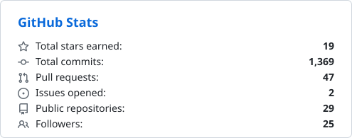
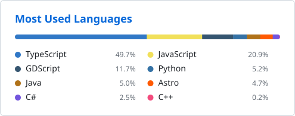

# 👋 Hi, I'm Elkhan Isayev

### 💻 Senior Software Engineer & Technical Advisor | Distributed Systems | Agentic Engineering | OSS Contributor

* 🌍 Based in Baku, Azerbaijan
* 🧑‍💼 Experienced in technical leadership — driving architecture decisions, mentoring engineers, and shipping production microservices
* 🧭 Technical advisor — guiding teams on architecture, scalability, and engineering best practices
* 📬 Email: is.elxan@gmail.com
* 🚀 Currently building resilient, event-driven microservices in Java & Go
* 🤖 Agentic coding is part of my everyday delivery — Claude Code, Cursor and Copilot on production work, and I build tools for coding agents too: [Erebus](https://github.com/Elkhan-Isayev/erebus) ships an MCP server with 51 tools
* 🧠 Exploring: Kubernetes, Cloud Design Patterns, High-Performance Messaging, and multi-agent workflows
* ⚡ Night owl productivity: 2AM code sessions are 🔥

    

---

### 🛠 Tech Stack

**AI & Agentic Engineering:**
Claude Code, Claude API, Model Context Protocol (MCP) servers, multi-agent workflows, agent-assisted review & refactoring, Cursor, GitHub Copilot

  
  
  
  
  

**Languages:**
Java, Go, TypeScript, JavaScript, C#, C/C++, SQL, PL/SQL, PHP

  
  
  
  
  
  
  
  
  

**Backend Frameworks & Platforms:**
Spring Boot, Spring Security, Hibernate, Camunda BPMN, Gin, .NET, Node.js, NestJS, Laravel

  
  
  
  
  
  
  

**Frontend Frameworks:**
React, Angular, Vue.js, jQuery, HTML5, CSS3, Bootstrap

  
  
  
  
  
  
  

**Infrastructure & Messaging:**
Docker, Kubernetes, Apache Kafka, PostgreSQL, Redis, Git

  
  
  
  
  
  

---

### 🤖 Featured Projects · AI & Developer Tools

#### 🌑 [Erebus](https://github.com/Elkhan-Isayev/erebus) · [Website](https://elkhan-isayev.github.io/erebus/)
One desktop app for Apache Kafka and RabbitMQ — browse topics and queues, produce and consume, manage consumer groups,
schemas, connectors and bindings, keep `kubectl port-forward`s alive in built-in terminal tabs. Ships an **MCP server with
51 tools**, so Claude Code can drive your brokers; read-only clusters stay read-only for the agent too. macOS, Windows, Linux.

#### 💹 [forex-ai-trader](https://github.com/Elkhan-Isayev/forex-ai-trader)
Autonomous forex trader for MetaTrader 5: technical analysis feeds **Claude**, which proposes the trade — and a
deterministic risk engine has final authority over the AI. TypeScript / Node.js, SQLite audit trail, kill-switch, dashboard.

#### 🛡 [cve-scanner](https://github.com/Elkhan-Isayev/cve-scanner)
Full-stack CVE scanner over a real-time NVD 2.0 feed: SemVer-aware version-range matching, an interactive React Flow graph
of findings, and a downloadable PDF report with remediation advice. Dockerised, 43 tests.

#### 🧠 [spring-boot-via-kafka](https://github.com/Elkhan-Isayev/spring-boot-via-kafka) ⭐
Event-driven demo with Spring Boot, Apache Kafka producers & consumers, and Docker.
A clean reference for anyone learning event streaming with Java.

### 🎮 Games

#### ⚓ [Corsairs: Wind of Freedom](https://github.com/Elkhan-Isayev/corsairs) · [Play in browser](https://elkhan-isayev.github.io/corsairs/)
Open-source remake in the spirit of *Sea Dogs II* on Godot 4.7 — 3D naval combat with a real wind model, boarding, a living
trade economy, nations & reputation, RPG skills. Procedural ships and a synthesized soundtrack, no original assets.
Windows, macOS, Linux and the web.

#### 🎯 [cs16-web](https://github.com/Elkhan-Isayev/cs16-web)
Counter-Strike 1.6 playable right in the browser over LAN — one Docker container, share a link, no installs.
Built with WebRTC + Xash3D compiled to WebAssembly.

#### 🎥 [cs-viewer](https://github.com/Elkhan-Isayev/cs-viewer)
Counter-Strike 1.6 `.dem` recordings replayed in 3D in the browser — the real map with baked lightmaps, real player models,
and a chase camera over any player's shoulder. One embeddable ES module; no game install, no video encoding, no server.

#### ♚ [chess-web](https://github.com/Elkhan-Isayev/chess-web)
Multiplayer chess for the office LAN — host on one machine, share a link, play with no internet. Server-enforced rules,
chess clocks, spectators, chat, rematch.

#### 🧩 [Game of Life](https://github.com/Elkhan-Isayev/game-of-life) · 🕹 [java-tetris](https://github.com/Elkhan-Isayev/java-tetris)
Conway's Game of Life with clean MVC separation and testable logic, and a compact classic Tetris built from scratch in Java.

### 🌍 Visualizations & Interactive Web

#### 🌋 [pangaea-drift](https://github.com/Elkhan-Isayev/pangaea-drift) · [Live Demo](https://elkhan-isayev.github.io/pangaea-drift/)
250 million years of continental drift, from Pangaea to today, on a real-time WebGL globe. All 399 tectonic plates follow
the peer-reviewed Müller et al. (2019) model, so the last frame is exactly today's Earth. Three.js, ray-marched atmosphere,
four UI languages.

#### 🏛 [Erebor](https://github.com/Elkhan-Isayev/erebor) · [Live Demo](https://elkhan-isayev.github.io/erebor/)
Interactive retellings of stories from before the common era. Pilot: Homer's *Odyssey*, in eight languages — scroll-driven
scenes, a voyage chart, music. Astro with a handful of vanilla TS scripts.

#### 📡 [WiFi WaveMap](https://github.com/Elkhan-Isayev/wifi-wavemap) · [Live Demo](https://elkhan-isayev.github.io/wifi-wavemap/)
Turns your router's live signal into a coverage map of a floor plan you draw, with animated wavefronts and radio "shadows"
behind walls. Log-distance path loss + ray-cast wall attenuation, zero dependencies.

#### 📊 [AzPulse](https://github.com/Elkhan-Isayev/azpulse) · [Live Demo](https://elkhan-isayev.github.io/azpulse/)
Live dashboard over Azerbaijan's national open data (opendata.az) — real-time country metrics and
market-demand signals. Pure static site, no backend.

#### 📈 [investment-platform-js](https://github.com/Elkhan-Isayev/investment-platform-js)
Collaborative app for analyzing stock-price change statistics — built together with a small team.

> 📂 Plus a collection of smaller projects: snake (C++), QR encoder/decoder, currency & deposit calculators, a coins catalog, and more — explore the [repositories tab](https://github.com/Elkhan-Isayev?tab=repositories).

---

### 📈 GitHub Stats

  <picture>
    <source media="(prefers-color-scheme: dark)" srcset="assets/stats-dark.svg" />
    
  </picture>
  <picture>
    <source media="(prefers-color-scheme: dark)" srcset="assets/top-langs-dark.svg" />
    
  </picture>

  <picture>
    <source media="(prefers-color-scheme: dark)" srcset="https://streak-stats.demolab.com/?user=Elkhan-Isayev&theme=github-dark-blue&hide_border=false" />
    
  </picture>

